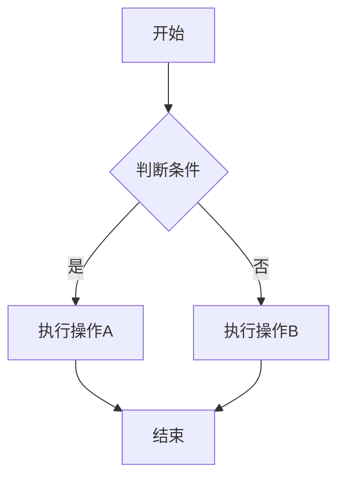
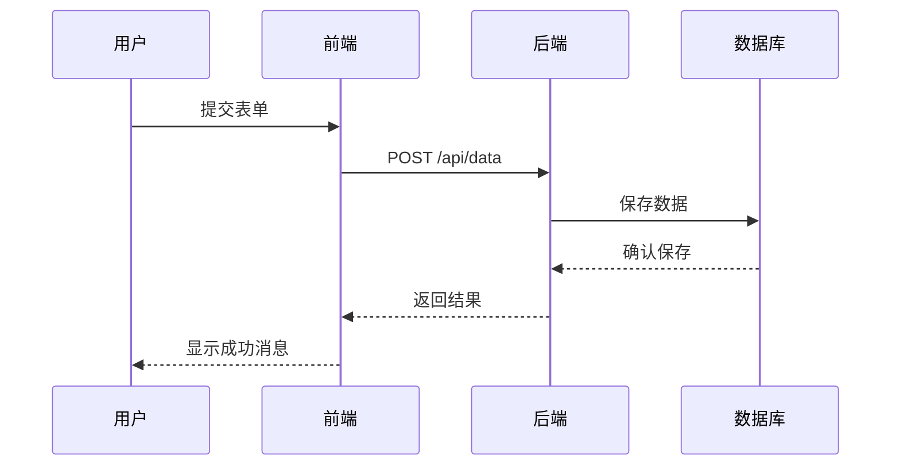
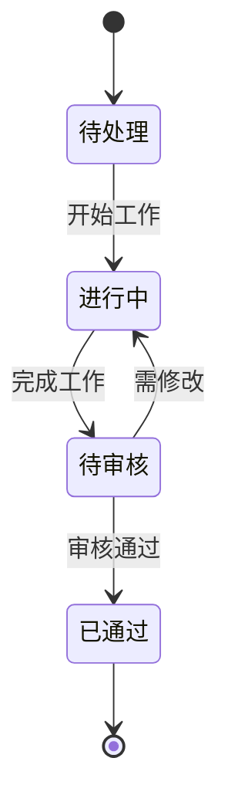
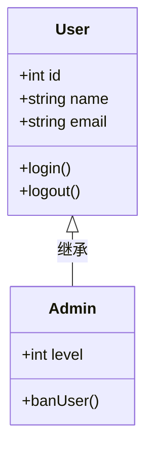

# 功能展示

本文展示 VitePress 支持的各种 Markdown 语法和扩展功能。

## 代码块

```typescript
// TypeScript 代码示例
interface User {
  id: number
  name: string
  email: string
}

function getUser(id: number): User {
  return {
    id,
    name: '张三',
    email: 'zhangsan@example.com'
  }
}
```

```python
# Python 代码示例
def fibonacci(n: int) -> list[int]:
    """计算斐波那契数列"""
    if n <= 0:
        return []
    if n == 1:
        return [0]

    fib = [0, 1]
    for i in range(2, n):
        fib.append(fib[i-1] + fib[i-2])
    return fib
```

::: tip
代码块支持多种语言高亮，包括 TypeScript、Python、JavaScript、Rust 等。
:::

## Mermaid 图表

### 流程图



### 时序图



### 状态图



### 类图



::: info
Mermaid 图表在 VitePress 中会自动渲染。
:::

## 数学公式

### 行内公式

爱因斯坦的质能方程：$E = mc^2$

勾股定理：$a^2 + b^2 = c^2$

### 块级公式

$$
\frac{1}{\sigma \sqrt{2\pi}} e^{-\frac{1}{2}\left(\frac{x-\mu}{\sigma}\right)^2}
$$

### 多行公式

$$
\begin{aligned}
f(x) &= \int_{-\infty}^{\infty} \hat{f}(\xi) e^{2\pi i \xi x} d\xi \\
&= \sum_{n=0}^{\infty} \frac{f^{(n)}(a)}{n!} (x-a)^n
\end{aligned}
$$

::: tip
数学公式使用 LaTeX 语法渲染。
:::

## 自定义容器

::: info
这是一个信息框，用于强调重要信息。
:::

::: tip
这是一个提示框，用于分享有用的技巧。
:::

::: warning
这是一个警告框，提醒您注意某些事项。
:::

::: danger
这是一个危险框，用于警示重要风险。
:::

::: details 点击查看详情
这是一个可折叠的详细信息区域。

可以包含任意 Markdown 内容：

- 列表
- **加粗文本**
- [链接](#功能展示)
- 代码块等
:::

## 表格

| 功能 | 支持情况 | 备注 |
|------|----------|------|
| 代码高亮 | ✅ | 支持多种语言 |
| Mermaid 图表 | ✅ | 自动渲染 |
| 数学公式 | ✅ | LaTeX 语法 |
| 自定义容器 | ✅ | 多种样式 |
| 搜索功能 | ✅ | 本地搜索 |

## 标签

这是一个带有标签的段落：
<span class="tag">#TypeScript</span> <span class="tag">#VitePress</span> <span class="tag">#Obsidian</span>

## 高亮文本

使用 `==高亮文本==` 可以突出显示重要内容。

> ==这是高亮显示的文本==，用于引起读者注意。

## 嵌入笔记

在 Obsidian 中可以使用 `[[笔记标题]]` 创建内部链接。

## 相关链接

- [VitePress 文档](https://vitepress.dev/)
- [Obsidian 官网](https://obsidian.md/)
- [Mermaid 文档](https://mermaid.js.org/)
- [KaTeX 支持](https://katex.org/)
