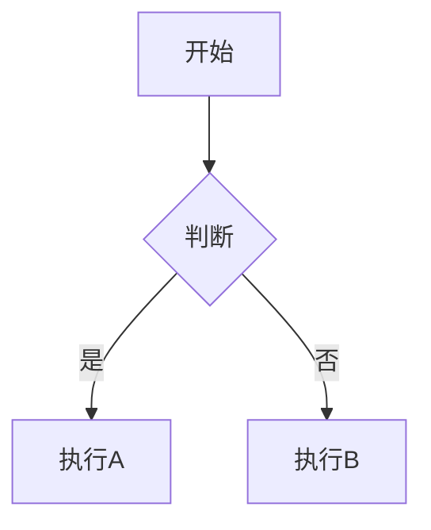

# 我的知识库

基于 [Obsidian](https://obsidian.md/) 和 [VitePress](https://vitepress.dev/) 构建的个人知识管理网站。

## 功能特性

- **Obsidian 兼容** - 支持 `[[内部链接]]`、`#标签`、`==高亮==` 等语法
- **自动侧边栏** - 根据目录结构自动生成侧边栏
- **Mermaid 图表** - 支持流程图、时序图、状态图等
- **数学公式** - KaTeX 支持 (`$...$` 和 `$$...$$`)
- **搜索功能** - 本地全文搜索
- **暗色主题** - 自动适配系统主题
- **自动部署** - GitHub Actions 自动部署到 Pages

## 项目结构

```
BLog/
├── .github/workflows/          # GitHub Actions 自动化部署脚本
├── .obsidian/                  # Obsidian 配置（不发布）
├── .vitepress/                 # VitePress 核心配置
│   ├── config.ts               # 主配置文件
│   ├── public/                 # 静态资源
│   │   └── favicon.svg         # 网站图标
│   ├── theme/                  # 自定义主题
│   │   ├── index.ts            # 主题入口
│   │   └── custom.css          # 自定义样式
│   └── utils/                  # 工具函数
│       ├── sidebar.ts          # 侧边栏生成
│       └── obsidian-adapter.ts # Obsidian 语法适配
├── 📁 01-知识管理/             # 知识管理相关笔记
├── 📁 02-技术笔记/             # 技术笔记
├── 📁 03-读书笔记/             # 读书笔记
├── 📁 assets/                  # 图片和附件
├── DEPLOY.md                   # 部署指南
├── index.md                    # 网站首页
├── package.json                # 项目依赖
└── README.md                   # 本文件
```

## 快速开始

### 本地开发

```bash
# 安装依赖
npm install

# 启动开发服务器
npm run docs:dev

# 构建生产版本
npm run docs:build

# 预览生产版本
npm run docs:preview
```

### 部署到 GitHub Pages

```bash
# 1. 创建 GitHub 仓库
# 2. 推送代码
git add .
git commit -m "初始化知识库"
git remote add origin https://github.com/你的用户名/仓库名.git
git push -u origin main

# 3. 启用 GitHub Pages
#    仓库 Settings → Pages → Source: GitHub Actions

# 4. 自动部署
#    推送后 GitHub Actions 自动构建并部署
```

访问: `https://<用户名>.github.io/<仓库名>/`

## Obsidian 写作指南

### 内部链接

```markdown
[[笔记标题]]           # 链接到笔记
[[笔记标题|别名]]      # 使用自定义文本
[[笔记#章节]]          # 链接到特定章节
```

### 标签

```markdown
#标签1 #标签2 #标签3
```

### 高亮

```markdown
==高亮文本==
```

### 任务列表

```markdown
- [ ] 未完成的任务
- [x] 已完成的任务
```

### Mermaid 图表



### 数学公式

```markdown
行内公式: $E = mc^2$

块公式:
$$
\frac{1}{\sqrt{2\pi}} e^{-\frac{x^2}{2}}
```

### 自定义容器

```markdown
::: tip
这是一个提示
:::

::: warning
这是一个警告
:::

::: danger
这是一个危险提示
:::
```

## 自定义配置

### 修改站点信息

编辑 `.vitepress/config.ts`:

```typescript
export default defineConfig({
  title: "你的站点标题",
  description: "你的站点描述",
  // ...
})
```

### 添加自定义 CSS

编辑 `.vitepress/theme/custom.css`

### 添加自定义页面

在对应分类目录下创建 `.md` 文件

## 技术栈

- **VitePress** - 静态网站生成器
- **Obsidian** - 笔记编辑工具
- **GitHub Actions** - 自动化部署
- **GitHub Pages** - 网站托管
- **Mermaid** - 图表渲染
- **KaTeX** - 数学公式渲染
