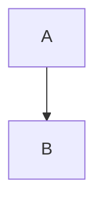

## Obsidian 语法支持

<div class="syntax-grid">

<div class="syntax-item">

**内部链接**

```markdown
[[笔记标题]]
```

</div>

<div class="syntax-item">

**标签**

```markdown
#标签名
```

</div>

<div class="syntax-item">

**高亮**

```markdown
==高亮文本==
```

</div>

<div class="syntax-item">

**Mermaid**



</div>

<div class="syntax-item">

**数学公式**

```markdown
$E = mc^2$
```

</div>

<div class="syntax-item">

**提示框**

```markdown
::: tip
提示内容
:::
```

</div>

</div>

<style>
.syntax-grid {
  display: grid;
  grid-template-columns: repeat(auto-fit, minmax(280px, 1fr));
  gap: 16px;
  margin: 32px 0;
}

.syntax-item {
  background: var(--vp-c-bg-alt);
  border: 1px solid var(--vp-c-divider);
  border-radius: 8px;
  padding: 16px;
}

.syntax-item code {
  font-size: 0.85em;
  background: var(--vp-c-bg-soft);
  padding: 2px 6px;
  border-radius: 4px;
}
</style>

## 最新更新


---

<div class="nav-grid">

<span>[部署指南](/DEPLOY.md)</span>
<span>[项目结构](/README.md)</span>
<span>[GitHub 仓库](https://github.com/HachGo/BLog)</span>

</div>

<style>
.nav-grid {
  display: flex;
  gap: 24px;
  justify-content: center;
  margin-top: 48px;
  padding-top: 32px;
  border-top: 1px solid var(--vp-c-divider);
}

.nav-grid a {
  color: var(--vp-c-brand-1);
  text-decoration: none;
  font-weight: 500;
}

.nav-grid a:hover {
  text-decoration: underline;
}
</style>
